#### Шпаргалка команд по четвертому уроку

<details>
<summary>Fork репозитория</summary>

✅ Для того, чтобы полноценно создать Fork репозитория и пройти полный цикл pull request и слияния изменений, нужен партнер или 2 аккаунта на GitHub.

✅ На странице репозитория в GitHub есть кнопка Fork, расположена она в верхнем правом углу, между кнопками "Watch" и "Start".

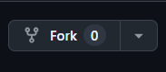

✅ Кликаем на неё, после нас перебрасывает в наш репозиторий на страницу создания репозитория.

✅ В данном случае мы создаём полную копию чужого репозитория в своём репозитории, имя можно изменить.

📌 <a id="contributors">Далее</a> находясь в нашем репозитории, нам необходимо склонировать себе на компьютер только что форкнутый репозиторий.

✅ Для этого:

✅ Через кнопку Code в GitHub (1), копируем ссылку, либо через HTTPS либо через SSH (если подключено) (2).

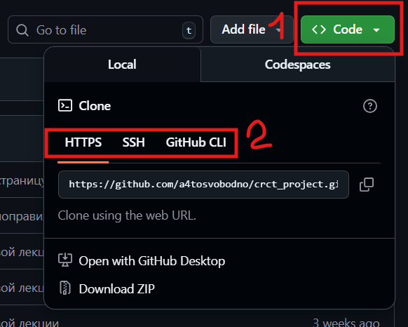

✅ Далее создаём папку, в которую будем клонировать проект на своём компьютере.

✅ Далее открываем любую консоль, в папке проекта и клонируем наш проект в папку.

```sh
git clone <скопированная ссылка>
```

✅ ВАЖНО!!! Разобраться с структурой проекта, иногда нужно дополнительно провалиться в папку, в которой находиться вся архитектура проекта, чтоб мы могли вносить свои изменения или видеть ветки гита.

✅ Для того, чтоб убедиться, что мы находимся в нужной папке, команда ниже должна нам выдавать результат, если мы используем VS code, должна появиться надпись возле адреса (main или master).

```sh
git status
```

✅ В противном случае будет ошибка.

```sh
$ git status
fatal: not a git repository (or any of the parent directories): .git
```

✅ Далее создаём новую ветку, одновременно переключаемся на неё.

```sh
git switch -c <имя_ветки>

#или

git checkout -b <имя_ветки>
```

✅ Далее вносим необходимые изменения в файл\файлы.

✅ Далее командой ниже добавляем необходимые изменения для коммита.

```sh
git add . # добавляем все измененный файлы

# или

git add <имя_файла> # добавляем выборочно файлы
```

✅ Далее создаём коммит командой ниже.

```sh
git commit -m "комментарий"
```

✅ Далее созданную нами ветку с изменениями нужно отправить (запушить) в наш репозиторий, командой ниже.

```sh
git push -u origin <название_новой_созданной_ветки>
```

✅ Далее возвращаемся в наш репозиторий и мы увидим вот такую плашку.

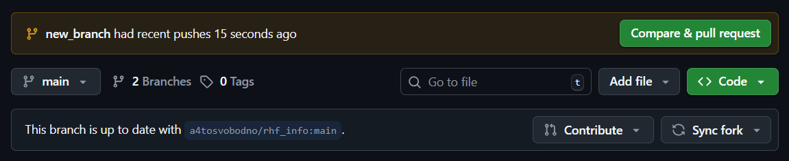

<details style="background-color: #808080">
<summary>Если такой плашки не появилось, то необходимо самостоятельно действовать через инструкцию внутри</summary>

✅ Находим вот эту кнопку в левой верхней части репозитория, жмём на неё.

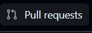

✅ Далее находим вот эту кнопку и жмём на неё.


✅ После необходимо выбрать менюшку для создания pull request для fork.


✅ Далее идем по инструкции вот с этого [места](#моё-место).

</details>

✅ Далее нажимаем зеленую кнопку "Compare & pull request".

✅ <a id="моё-место">Далее</a> мы попадаем в блок создания pull request.

🎯 В этом блоке мы смотрим, в какой репозиторий будем сливать изменения (1), в какую ветку будем сливать изменения (2).

✅ Из какого репозитория мы будем сливать изменения (3) и из какой ветки (4).

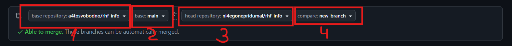

✅ Также можно оставить свои комментарии к изменениям (1,2).

✅ Далее жмем кнопку "Create pull request" (3).

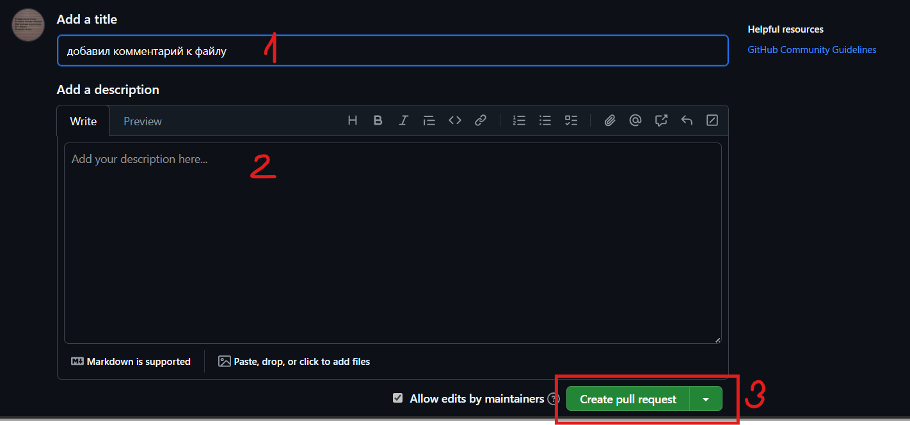

✅ Если мы сделали всё правильно, то мы получаем успешное создание pull request.

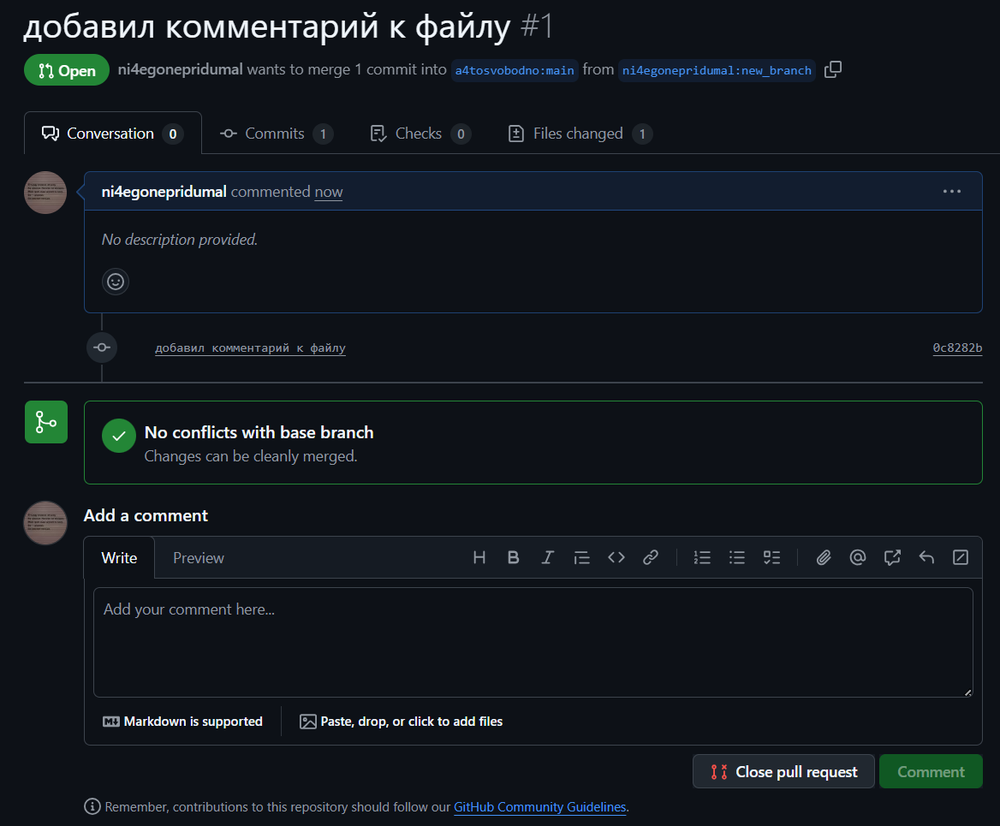

✅ Далее переходим в аккаунт, из которого мы сделали fork или просим нашего напарника принять наш pull request.

✅ В аккаунте с которого был сделан fork на вкладке pull request появится количество pull request.

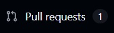

✅ Кликаем на него и попадаем в менюшку взаимодействия с входящим pull request, в котором кликаем на входящий pull request.

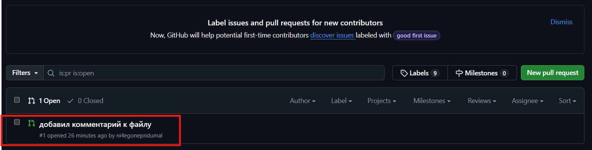

✅ В этой менюшке мы видим, от кого пришел pull request, сколько там коммитов (1), а также список изменяемых файлов (2).

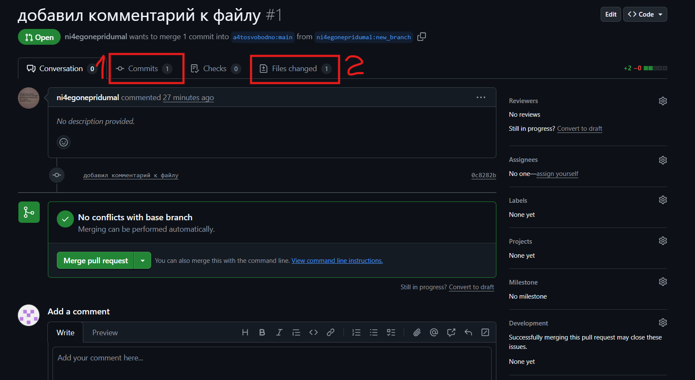

✅ Далее кликаем на список изменяемых файлов из картинки выше (2), мы попадаем в меню входящих изменений и измененных файлов.

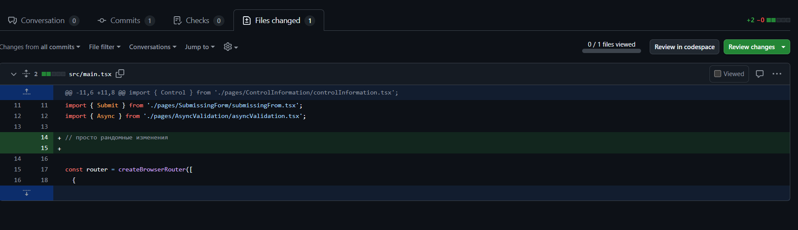

✅ Далее, если мы хотим что-то прокомментировать или нам непонятны изменения, которые к нам пришли, или они вообще нам не нравятся и не нужны в проекте, наводим на строку и мы увидим синий плюсик (1), нажав на котором, у нас открывается окна для добавления комментариев (2).

✅ В данном окне вы сможете внести какие-то комментарии.

✅ Если нужен только один комментарий, то нажимаем кнопку (3).

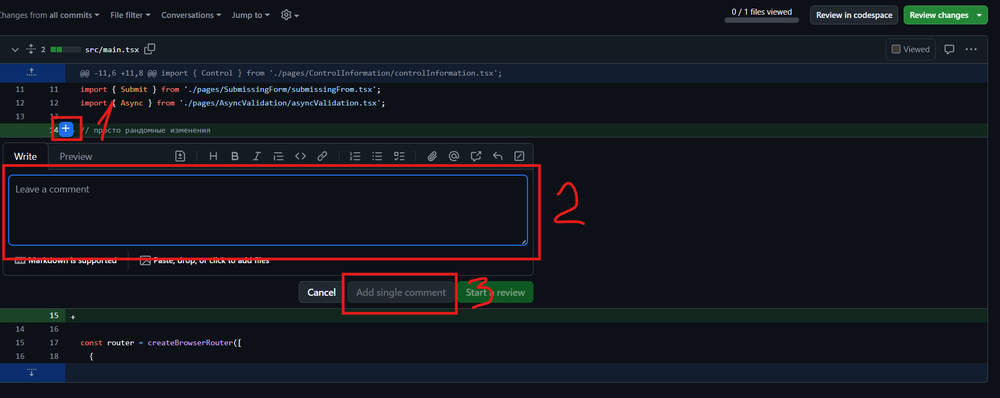

✅ Мы также можем запустить процесс ревью "Start review", при котором можем оставлять несколько комментариев к файлам и завершить его можно, нажав на кнопку "Finish you review".

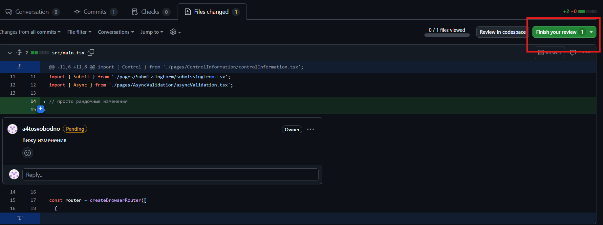

✅ После нажатия на кнопку "Finish you review", у нас открывается менюшка, в которой мы также можем оставить свои комментарии и выбрать способ завершения review.

1. Отправить просто комментарий без одобрения.
2. Отправить комментарий и одобрить изменения.
3. Отправьте комментарий, который необходимо учесть перед слиянием.

✅ Далее можно завершить review.

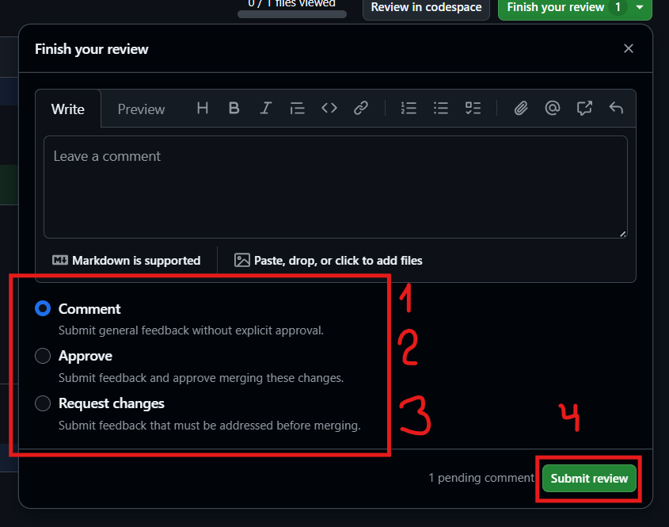

✅ Со стороны профиля, от которого пришли изменения в репозиторий, также на вкладке репозитория, который мы форкнули, мы увидим все комментарии, что нам отправили, и мы теми же действиями можем прокомментировать комментарии владельца форкнутого репозитория.

✅ После того, как мы договорились по изменениям, с профиля владельца репозитория, мы можем осуществить слияние (мердж) ветки в репозиторий, через кнопку "Merge pull request" (1), при этом можем выбрать через стрелочку на кнопке вариант поведения для ветки, и оставить комментарий.

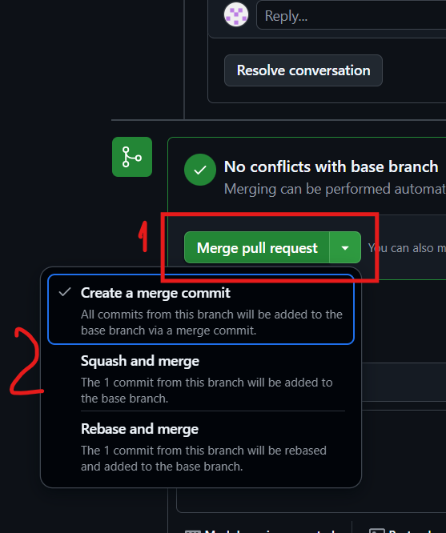

✅ Если всё прошло успешно, то мы увидим вот такую плашку, и наш pull request прошел успешно.

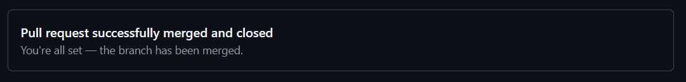

</details>

<details>
<summary>Установить связь с репозиторием с которого сделали Fork</summary>

✅ Для того, чтобы установить связь с форкнутым репозиторием:

```sh
git remote add upstream <url форкнутого репозитория>

# upstream - это имя, которое мы можем сами установить
```

✅ Проверить, что мы следим за оригиналом, можно командой, в списке должен быть репозиторий с которого мы сделали форк.

```sh
git remote -v
```

✅ Чтобы обновить свой форк актуальными изменениями из оригинала:

```sh
git checkout main # перешли в ветку main/master
git fetch upstream # получаем новые данные из удаленного репозитория upstream
git merge upstream/main # сливаем в main изменения
git push origin main # отправляем на удаленный наш репозиторий
```

</details>
<details>
<summary>Работа в команде в одном репозитории</summary>

✅ В репозитории проекта находим кнопку Settings, нажимаем её.

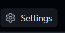

✅ Далее находим кнопку Collaborators, нажимаем на неё.


✅ Далее находим Add people, нажимаем её.


✅ После в открывшемся меню, находим нужного нам человека и отправляем ему приглашение, чтоб работать надо одним проектом в паре.

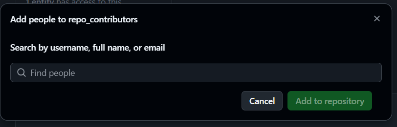

✅ Вашему напарнику, или тому, кому вы отправляете инвайт, придет на почту приглашение, которое необходимо принять, чтоб работать надо одним проектом в паре.

✅ Далее мы делаем то же самое, что делали с форком репозитория с пункта с эмодзи 📌 до 🎯 - в этом блоке, мы не выбираем форкнутый репозиторий, а выбираем лишь между ветками в одном репозитории, первый блок куда сливаем, второй блок откуда сливаем.

✅ Далее идём снова по списку из блока по форкнутым репозиториям.

✅ Единственное, что добавляется в конце, когда мы работаем с одним репозиторием, это возможность удалить ветку, изменения из которой мы слили.

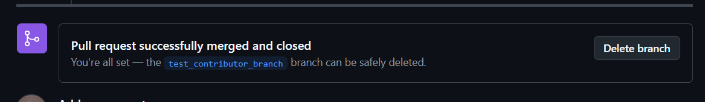

</details>
<details>
<summary>Как создать конфликт в репозитории</summary>

✅ Для того, чтобы создать конфликт при слиянии, вам нужно изменить один и тот же файл в разных ветках, и сделать коммит в каждой ветке, и при попытке слить изменения из одной ветки в другую, будет конфликт.

✅ Разрешить конфликт можно разными способами в зависимости от того, что вы используете, и насколько он много файлов затрагивает.

1. Маленький конфликт можно разрешить прямо через интерфейс GitHub, при возникновении конфликта, вы увидите определенные меню в GitHub.

2. Можно через VS Code в данном случае, при появлении конфликта нужно понимать в какую ветку вы пытаетесь слить изменения.

Например вы создали ветку new_feature, написали свою фичу туда, и решили залить в мастер.

Но при попытке это сделать возник конфликт.

Тогда вам нужно вернуться в VS Code и сделать следующее:

✍️ Встать в ветку new_feature
✍️ Командой ниже стянуть изменения из удаленной ветки мастер, то есть той ветки в которую вы пытаетесь слить свои изменения.

```sh
git pull origin master
```

✍️ Далее разрешить конфликт.

✍️ Далее сделать коммит.

```sh
git add .

git commit -m "комментарий"
```

✍️ И запушить уже изменения в вашей ветке new_feature.

```sh
git push
```

✅ В интерфейсе GitHub мы увидим, что наши изменения больше не конфликтуют, автоматически, единственное, что может потребоваться чуть подождать и обновить страницу репозитория.

</details>
